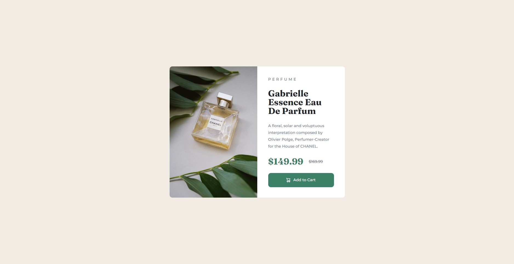

# Frontend Mentor - Product preview card

This is a solution to the [Product preview card component challenge on Frontend Mentor](https://www.frontendmentor.io/challenges/product-preview-card-component-GO7UmttRfa).

## Table of contents

- [Overview](#overview)
  - [The challenge](#the-challenge)
  - [Screenshot](#screenshot)
  - [Links](#links)
- [My process](#my-process)
  - [Built with](#built-with)
  - [What I learned](#what-i-learned)
  - [Continued development](#continued-development)
  - [Useful resources](#useful-resources)
- [Author](#author)
- [Acknowledgments](#acknowledgments)

## Overview

### The challenge

Users should be able to:

- View the optimal layout depending on their device's screen size
- See hover and focus states for interactive elements

### Screenshot



### Links

- Solution URL: [Add solution URL here](https://your-solution-url.com)
- Live Site URL: [Add live site URL here](https://your-live-site-url.com)

## My process

### Built with

- HTML5
- CSS
- Flexbox
- CSS Grid

### What I learned

Learned to change a image depeding on device's screen size.

```html

```
```css
.mobile-img {
  display: none;
}

@media (max-width: 670px) {
  .mobile-img {
    display: flex;
  }
}
```

## Author

- LinkedIn - [Bruno Costa](https://www.linkedin.com/in/bcosta98/)
- Frontend Mentor - [@BrnCosta](https://www.frontendmentor.io/profile/BrnCosta)
- Twitter - [@_brnCosta](https://www.twitter.com/_brnCosta)
